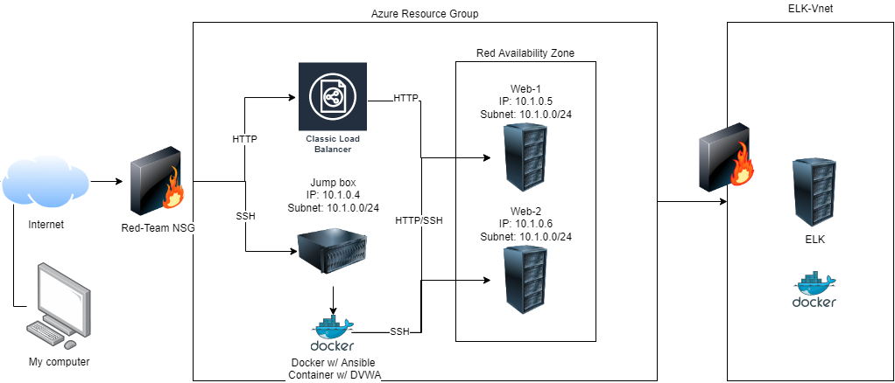

## Automated ELK Stack Deployment

The files in this repository were used to configure the network depicted below.



These files have been tested and used to generate a live ELK deployment on Azure. They can be used to either recreate the entire deployment pictured above. Alternatively, select portions of the yml file may be used to install only certain pieces of it, such as Filebeat.

  [Pentest.yml](Ansible/Pentest.yml)

This document contains the following details:
- Description of the Topologu
- Access Policies
- ELK Configuration
  - Beats in Use
  - Machines Being Monitored
- How to Use the Ansible Build


### Description of the Topology

The main purpose of this network is to expose a load-balanced and monitored instance of DVWA, the D*mn Vulnerable Web Application.

Load balancing ensures that the application will be highly resilient, in addition to restricting traffic to the network.
What aspect of security do load balancers protect?
Load balancing is the process of distributing network traffic across multiple servers. This ensures no single server bears too much demand. By spreading the work evenly, load balancing improves application responsiveness. It also increases availability of applications and websites for users. Modern applications cannot run without load balancers.
What is the advantage of a jump box? 
Using JB we can connect to the other VM's using IP, JB prevents all Azure VM's to expose to the public.By using security group, we can restrict the IP addresses to communicate with JB.We can block the public IP address associated with the VM. It helps to improve security.

Integrating an ELK server allows users to easily monitor the vulnerable VMs for changes to the logs and system metrics data.
What does Filebeat watch for?
Filebeat is a lightweight shipper for forwarding and centralizing log data. Installed as an agent on your servers, Filebeat monitors the log files or locations that you specify, collects log events, and forwards them either to Elasticsearch or Logstash for indexing.
What does Metricbeat record?
Metricbeat is a lightweight shipper that you can install on your servers to periodically collect metrics from the operating system and from services running on the server. Metricbeat takes the metrics and statistics that it collects and ships them to the output that you specify, such as Elasticsearch or Logstash.


| Name     | Function | IP Address | Operating System |
|----------|----------|------------|------------------|
| Jump Box | Gateway  | 10.1.0.4   | Linux            |
| ELK1     | SIEM         | 10.0.0.4   | Linux            |
| Web1     | Webserver         | 10.1.0.5   | Linux            |
| Web2     | Webserver         | 10.1.0.6   | Linux            |

### Access Policies

The machines on the internal network are not exposed to the public Internet. 

Only the Jump Box machine can accept connections from the Internet. Access to this machine is only allowed from the following IP addresses:
My personal IP 


Machines within the network can only be accessed by 
My personal IP
Which machine did you allow to access your ELK VM? What was its IP address? 10.1.0.4

A summary of the access policies in place can be found in the table below.

| Name     | Publicly Accessible | Allowed IP Addresses |
|----------|---------------------|----------------------|
| Jump Box | Yes                 | 104.208.83.76
   Elk1    |  No                 |  104.208.83.76 
|  Web1        |   No                  | 10.1.0.5                     |
|  Web2        |   No                  | 10.1.0.6                     |

### Elk Configuration

Ansible was used to automate configuration of the ELK machine. No configuration was performed manually, which is advantageous because automatization saves resources like time and human errors. Future changes in configuration can be implemented faster and by only one person.

The playbook implements the following tasks:
The playbook implements the following tasks:

Specify a different group of machines as well as a different remote user
```
-name: Config elk VM with Docker:
 hosts: elk
 remote_user: azureuser
 tasks:
Increase System Memory :
- name: Use more memory
sysctl:
  name: vm.max_map_count
  value: '262144'
  state: present
  reload: yes
Install the following services:
   `docker.io`
   `python3-pip`
   `docker`, which is the Docker Python pip module.
Launching and Exposing the container with these published ports:
 `5601:5601` 
 `9200:9200`
 `5044:5044`
 ```
The following screenshot displays the result of running docker ps after successfully configuring the ELK instance.

### Target Machines & Beats

This ELK server is configured to monitor the following machines:

Web1 	  10.1.0.5
Web2		10.1.0.6

We have installed the following Beats on these machines:

ELK Server, Web1 and Web2

- The ELK Stack Installed are: FileBeat and MetricBeat
These Beats allow us to collect the following information from each machine:

  - Filebeat: Log events
Metricbeat: Metrics and system and system statistics
These Beats allow us to collect the following information from each machine:


### Using the Playbook

To use the playbook, you will need to have an Ansible control node already configured. Assuming you have such a control node provisioned:

SSH into the control node and follow the steps below:

For ELK installation VM Configuration:
ion


Run the Playbook using this command:                      
  - ansible-playbook [install-elk.yml](Ansible/Elk.yml)

Verify with ansible-playbook install-elk.yml again and everything should say "ok" in green.

Which file is the playbook? Where do you copy it?

Answer: A playbook file is a .yml, and you copy them to source and destination

     copy:
       src: /etc/ansible/filebeat-config.yml
       dest: /etc/filebeat/filebeat.yml
Which file do you update to make Ansible run the playbook on a specific machine? How do I specify which machine to install the ELK server on versus which to install Filebeat on?
Answer: Update the host file. To specify you add the private IP under elk, not webservers in the hosts file.

Which URL do you navigate to in order to check that the ELK server is running?


Additional Commands Used

| COMMAND	 | PURPOSE   | 
|---|---|
|  sudo apt-get update | this will update all packages  |  
|  sudo service docker start |  start the docker application |
|  sudo apt install docker.io | install docker application  |   
|  systemctl status docker | status of the docker application  |   
|  sudo docker pull cyberxsecurity/ansible | download the docker file  |
|  sudo docker run -ti cyberxsecurity/ansible bash | run and create a docker image  |
| sudo docker start  | starts the image specified  |
|  sudo docker ps -a | list all active/inactive containers  |
|  sudo docker attach | effectively sshing into the ansible  |
|  ssh-keygen | create a ssh key  |
| ansible -m ping all  | check the connection of ansible  |
|                       |                                 |